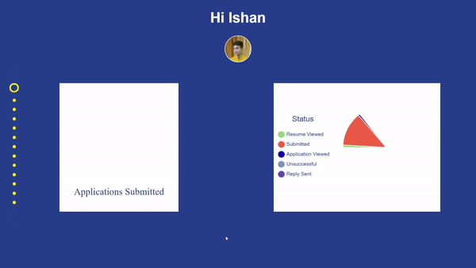
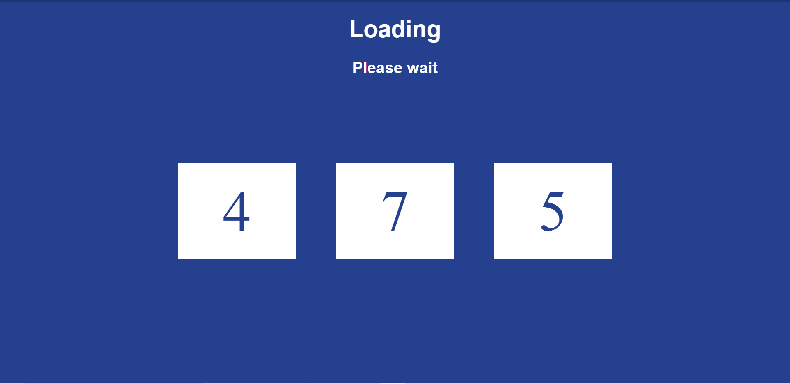
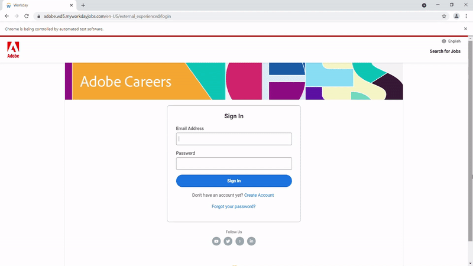
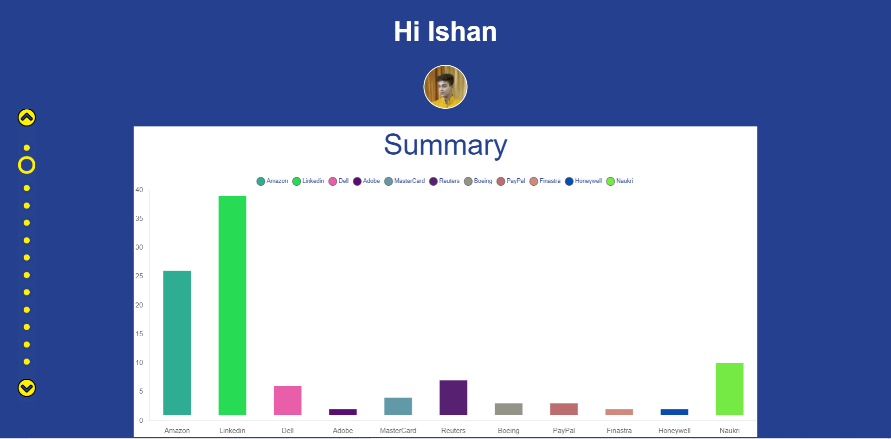
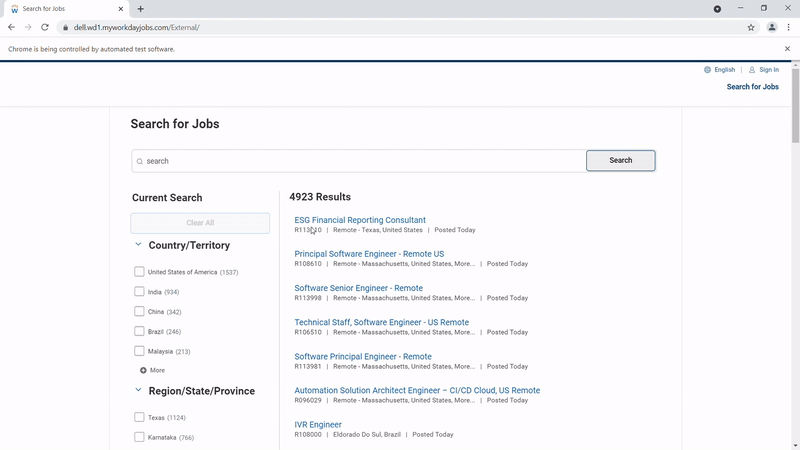
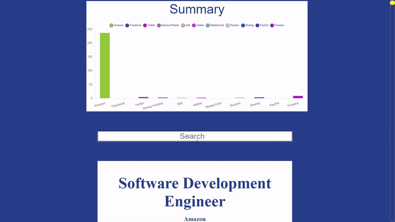

Job Applications Tracker
========================

Synopsis
--------
Dashboard to view all job applications and search for relevant openings via scraping.

DISCLAIMER
----------
Do not use this repository to automate the job application process. This repository is only intended to view the status of existing applications and search for new openings.

Requirements
------------
pip install -r requirements.txt

- requests
- selenium
- beautifulsoup4

Simply add your login details to the details.json file.

How it works
------------

1) Timer starts
---------------

2) User authenticated in background and application data is processed
---------------------------------------------------------------------

3) On completition, dashboard is presented
------------------------------------------

Job Search
==========

How it works
------------

1) Openings data is scraped and filtered in background
---------------------------------------------------------------------

2) On completition, dashboard is presented with new openings
------------------------------------------------------------

Scope for Enhancement
---------------------

Additional preferences and more website can easily be added.

